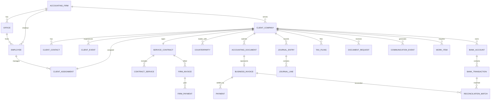

# Logical ERD

```mermaid
erDiagram
  ACCOUNTING_FIRM ||--o{ OFFICE : has
  ACCOUNTING_FIRM ||--o{ EMPLOYEE : employs
  OFFICE ||--o{ EMPLOYEE : hosts
  ACCOUNTING_FIRM ||--o{ CLIENT_COMPANY : serves
  CLIENT_COMPANY ||--o{ CLIENT_CONTACT : has
  CLIENT_COMPANY ||--o{ CLIENT_EVENT : experiences
  CLIENT_COMPANY ||--|| CLIENT_ASSIGNMENT : assigned
  EMPLOYEE ||--o{ CLIENT_ASSIGNMENT : manages
  CLIENT_COMPANY ||--|| SERVICE_CONTRACT : signs
  SERVICE_CONTRACT ||--o{ CONTRACT_SERVICE : includes
  CLIENT_COMPANY ||--o{ BANK_ACCOUNT : owns
  CLIENT_COMPANY ||--o{ COUNTERPARTY : trades_with
  CLIENT_COMPANY ||--o{ ACCOUNTING_DOCUMENT : submits
  ACCOUNTING_DOCUMENT ||--o| BUSINESS_INVOICE : represents
  BUSINESS_INVOICE ||--o{ PAYMENT : settled_by
  BANK_ACCOUNT ||--o{ BANK_TRANSACTION : contains
  BANK_TRANSACTION ||--o{ RECONCILIATION_MATCH : matched
  BUSINESS_INVOICE ||--o{ RECONCILIATION_MATCH : reconciled
  CLIENT_COMPANY ||--o{ JOURNAL_ENTRY : records
  JOURNAL_ENTRY ||--o{ JOURNAL_LINE : contains
  CLIENT_COMPANY ||--o{ TAX_FILING : files
  CLIENT_COMPANY ||--o{ DOCUMENT_REQUEST : receives
  CLIENT_COMPANY ||--o{ COMMUNICATION_EVENT : generates
  CLIENT_COMPANY ||--o{ WORK_ITEM : requires
  SERVICE_CONTRACT ||--o{ FIRM_INVOICE : billed
  FIRM_INVOICE ||--o{ FIRM_PAYMENT : paid
```
